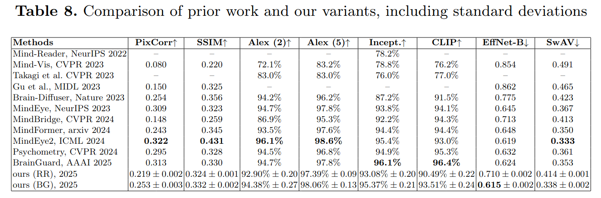
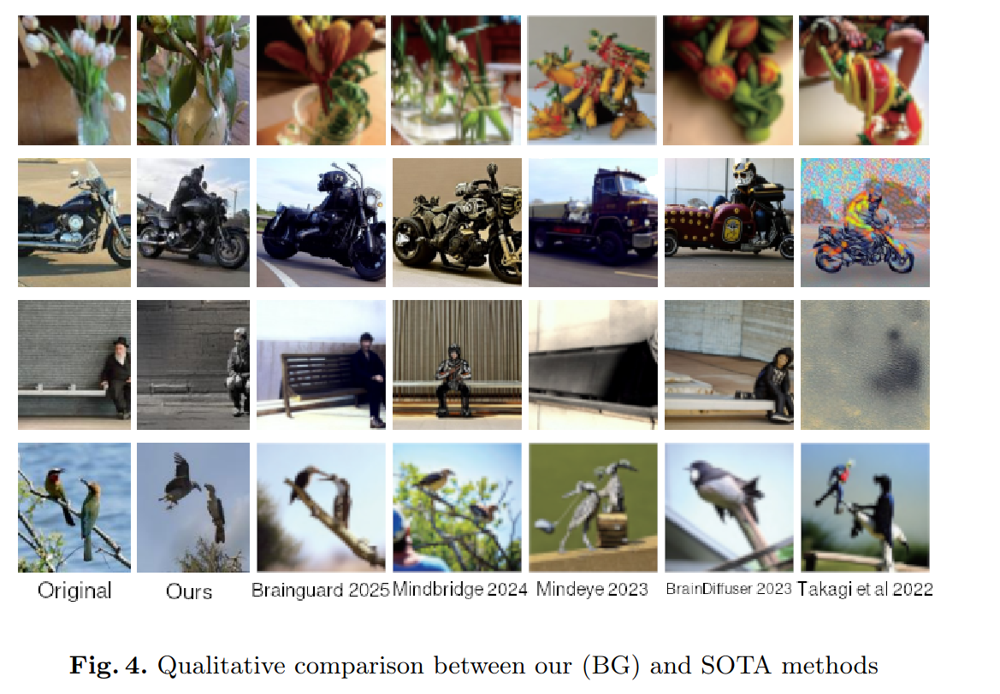

# Efficient Reconstruction of Visual Stimuli from fMRI Using Diffusion Models  

This repository contains the code developed as part of my Bachelor’s thesis *“Efficient Reconstruction of Visual Stimuli from fMRI Using Diffusion Models”*, submitted at Babeș-Bolyai University in 2025.  
The project investigates the performance of **resource-efficient pipelines** for brain-to-image reconstruction.  
As a secondary goal, a **web application** was developed to enable direct interaction with the trained models.  

## Visual Brain Decoding: Context  

Visual brain decoding aims to reconstruct perceived visual stimuli from brain recordings such as fMRI.Recent progress with **latent diffusion models** has substantially improved semantic fidelity in reconstructions.  

Current approaches typically rely on an established procedure for extracting **257 (visual) + 77 (textual) CLIP embeddings**, leading to high computational costs.  

This work explores whether **high-quality reconstructions** can be achieved by predicting a **reduced number of informative embeddings** (derived from IP-AdapterPlus), thereby making the process more computationally efficient.  

## Methodology  

- **Dataset**: Natural Scenes Dataset (NSD), experiments performed on subjects 1, 2, 5, 7  
- **Training Pipelines**:  
  - *Single subject*: ridge regression based, inspired by *BrainDiffuser*  
  - *Multi-subject*: federated learning approach, adapted from *BrainGuard*  
- **Evaluation**:  
  - *Qualitative evaluation*  
  - *Quantitative evaluation*:  
    - Low-level metrics: PixCorr, SSIM, AlexNet2, AlexNet5  
    - High-level metrics: Inception-v3, CLIP, EfficientNet-B1, SwAV-ResNet50  

## Results  

Quantitative and qualitative comparisons with SOTA can be viewed below.

## System Architecture  

The web application is composed of several core components:  

### Core Components  
- **Frontend**: Built with **React**, **Zustand**, and **Material UI**; provides an interactive UI for data upload, reconstructions, and visualization  
- **Web Backend Server**: **FastAPI** service; handles users, recordings, reconstructions, and notifications  
- **Reconstruction Server**: **FastAPI** service running ML pipelines; developed in **PyTorch** and **Hugging Face Diffusers**  
- **Database**: **PostgreSQL** (managed via **AWS RDS**); stores users, uploads, reconstructions, and statistics  
- **Messaging**: **Amazon SQS** for asynchronous job handling  
- **Authentication**: performed with **Amazon Cognito**  
- **Testing frameworks**: `pytest`, `jest`, `cypress`  

### Deployment Setup  
- Frontend & Web Backend → Dockerized, deployed on **AWS EC2**  
- Database → **AWS RDS**  
- Reconstruction Server → **Hugging Face Spaces** (models hosted on Hugging Face Hub)  

## Application Features  

- Reconstruct visual stimuli from fMRI data using diffusion-based pipelines  
- Configure inference steps for reconstructions  
- Compute evaluation metrics (PixCorr, SSIM)  
- Upload and manage brain recordings (`.npy` voxel arrays + stimulus image)  
- Track performance statistics per user  
- Secure user accounts & authentication (via AWS Cognito)  
- Interactive web interface for reconstructions and comparisons  

## Acknowledgements  

This work builds upon several key contributions in the field of visual brain decoding and generative modeling. We thank the authors for generously sharing their codebases.
- [**Brain Diffuser** (Ozcelik et al., 2023)] (https://github.com/ozcelikfu/brain-diffuser)
- [**BrainGuard** (Tian et al., 2025)](https://github.com/kunzhan/brainguard)
- [**IP-Adapter**(Ye et al., 2023)] (https://github.com/tencent-ailab/IP-Adapter)
- [**Natural Scenes Dataset (NSD)** (Allen et al., 2021)] (https://naturalscenesdataset.org/)
